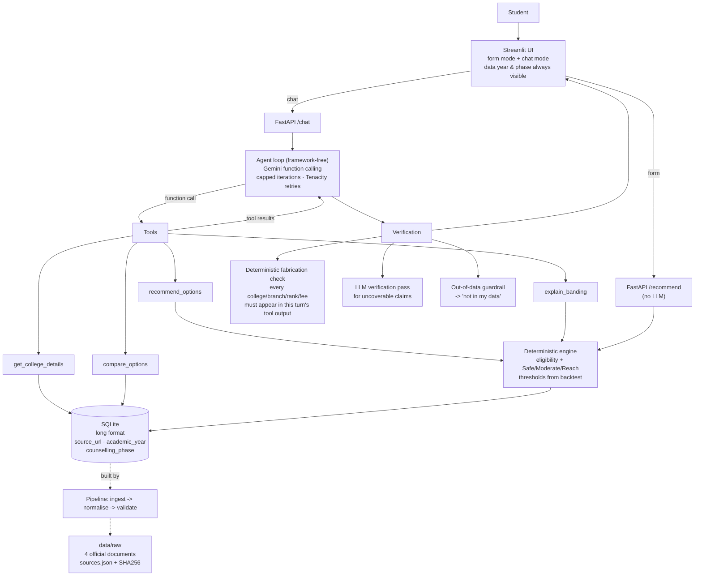

# Counselling Copilot — Design

**Status:** Phase 0 (design + data-source research). No application code written yet.
**Exam:** AP EAPCET (renamed from AP EAMCET in 2022), MPC stream (engineering).
**Last updated:** 2026-09-22

---

## 1. Problem

A student finishing AP EAPCET gets a rank and a deadline. What they actually need to
decide is: *given my rank, category, gender and region, which college+branch options are
realistic, and which are a gamble?*

What exists today is bad in two specific ways:

- **Official data is unusable as-is.** The authoritative "last rank" statements are 60-page
  PDFs with 30 columns, one column per category×gender. Finding your own number means
  scrolling to your college, then counting across to `BCB_GIRLS`. There are ~1,500
  college-branch rows per year.
- **Everything else invents numbers.** Coaching-centre "rank predictors" produce confident
  cutoffs with no source, no year and no phase attached.

There is also a hard constraint that most tools ignore. The official statement carries this
disclaimer:

> "The statement shall be used only for information to assess the mode of opting by
> candidates and **shall in no way reflect the rank upto which seat can be allotted in the
> present academic year**."

So the honest product is *not* a predictor. It is a **structured, sourced, explained view of
what actually happened last year**, with bands whose error rate we have measured and
publish.

## 2. Users

| User | Needs |
|---|---|
| **Student** (primary) | A shortlist they can act on, grouped by risk, with the fee and region they care about. Follow-up questions in plain language. |
| **Parent** | Fee, location, college type. Wants to know *why* an option is called Safe. |
| **Me (portfolio)** | A system where every number is traceable to an official PDF and every claim is backed by an eval run. |

## 3. User stories

1. As a student, I enter rank 45,000 / BC-B / female / AU region and get options grouped
   Safe / Moderate / Reach, each showing last year's closing rank and the data year.
2. As a student, I ask "which of these have CSE under ₹1L fees?" and get a filtered list
   built from tool results, not from the model's memory.
3. As a student, I ask "compare AITS Rajampet and Vignan Vizag for ECE" and get a
   side-by-side of the fields we actually hold.
4. As a student, I ask "why is this one Moderate?" and get the actual rule and numbers
   (my rank ÷ last year's closing rank, and the threshold it fell in).
5. As a parent, I ask "what are the placements like?" and get an honest **"not in my
   data"** — never an invented figure.

## 4. Architecture

**Why no RAG / vector DB / LangChain / LangGraph.** The corpus is ~1,500 structured rows
per year with a fixed schema. Every question a user asks maps to a `WHERE` clause and an
arithmetic comparison. Embedding-based retrieval would make exact numeric filtering
*worse* (approximate matching on numbers) while adding an index, an embedding model and a
failure mode. The agent loop is ~100 lines; a graph framework would add a dependency
without removing any of them. If a genuine need appears — e.g. free-text counselling rule
documents that must be searched — that is the moment to revisit, with a concrete case.

## 5. Data sources

All four documents were located and downloaded on **2026-09-22**, and are committed under
`data/raw/` with SHA-256 hashes in `data/raw/sources.json`.

| Year | File | Format | Host | Status |
|---|---|---|---|---|
| 2022 | `APEAMCET2022LASTRANKDETAILS.pdf` | PDF, 60 pp | apsche.ap.gov.in | ✅ downloaded |
| 2023 | `APEAPCET2023LASTRANKDETAILS.pdf` | PDF, 57 pp | apsche.ap.gov.in | ✅ downloaded |
| 2024 | `APEAMCET2024LASTRANKDETAILSNONSW.XLS` | **XLS (native)** | apsche.ap.gov.in | ✅ downloaded |
| 2025 | `EAPCET2025LASTRANKDETAILS.pdf` | PDF, 60 pp | cap.apcfss.in | ✅ downloaded |

Exact URLs:

- https://apsche.ap.gov.in/Pdf/APEAMCET2022LASTRANKDETAILS.pdf
- https://apsche.ap.gov.in/Pdf/APEAPCET2023LASTRANKDETAILS.pdf
- https://apsche.ap.gov.in/Pdf/APEAMCET2024LASTRANKDETAILSNONSW.XLS
- https://cap.apcfss.in/TET-PDF/EAPCET-DOCS/EAPCET2025LASTRANKDETAILS.pdf

No captcha or login was required. Everything downloaded with plain `curl`.

### 5.1 The portal moved — and the old one is dead

AP counselling used to run on `eapcet-sche.aptonline.in`. That host still resolves in DNS
but **refuses all connections** (tested from two networks). Counselling has moved to
**`cap.apcfss.in`** (Common Admissions Portal, run by APCFSS). The 2025 file was found by
reading the JS bundle of that single-page app; it is not linked from any crawlable HTML page.

This matters beyond convenience: **source URLs for this data rot fast.** That is why the raw
files are committed to the repo with hashes rather than fetched at build time.

### 5.2 What each statement contains

Every year has the same shape: **one row per (institution × branch)**, with one column per
category×gender.

Common columns: `SNO`, institution code, institution name, `type`, `INST_REG`, `DIST`,
`branch_code`, then the category×gender rank columns.

Categories present: **OC, SC, ST, BC-A, BC-B, BC-C, BC-D, BC-E, OC-EWS** — each split
`_BOYS` / `_GIRLS`.

College types: `PVT` (private, 232 institutions in 2024), `UNIV` (16), `SF` (self-financed, 13),
`PU` (private university, 10), `SS` (2). Local areas: **AU** and **SVU** only (OU is
Telangana). `INST_REG = 'SW'` means *State wide*, documented in the file itself.

### 5.3 Schema drift across years — three variants

This is the real engineering work in Phase 1.

| | 2022 | 2023 | 2024 | 2025 |
|---|---|---|---|---|
| Columns | 31 | 31 | 31 | **30** |
| Institution code field | `inst_code` | `INSTCODE` | `INSTCODE` | `inst_code` |
| Institution name field | `inst_name` | `NAME OF THE INSTITUTION` | `NAME OF THE INSTITUTION` | `inst_name` |
| Affiliating univ. | `AFFLIA.UNIV` | `AFFL.` | `AFFL.` | **absent** |
| `PLACE` / `COED` / `ESTD` | ✅ | ✅ | ✅ | **absent** |
| Region field | `Local_Area` (mostly blank) | `A_REG` | `A_REG` | `Local_area` (populated) |
| SC columns | `SC_BOYS/GIRLS` | same | same | **`SCI` / `SCII` / `SCIII` × B/G** |
| Category×gender cols | 18 | 18 | 18 | **22** |
| `COLLFEE` | ✅ | ✅ | ✅ | **❌ absent** |

**Two breaking changes in 2025:**

1. **SC sub-classification.** SC was split into SC-I / SC-II / SC-III (per the AP SC
   sub-classification G.O.). An SC student's 2024 row has no 1:1 successor in 2025.
2. **The fee column was dropped.** See open question Q1.

### 5.4 Coverage and overlap (2024 vs 2025)

| | 2024 | 2025 | Common |
|---|---|---|---|
| Institutions | 275 | 274 | **244** |
| Branch codes | 69 | 73 | **67** |
| College-branch pairs | 1,479 | 1,509 | **1,314** |

1,314 matched pairs × ~9 categories × 2 genders is a solid backtest base.

### 5.5 Fee data

`COLLFEE` is **inside** the 2022–2024 rank statements (e.g. ₹43,000 / ₹53,500), so no
separate fee source is needed for those years. 2025 has no fee column.

Fees are set by AFRC / APHERMC for a **3-year block period**. `afrc.ap.gov.in` was
unreachable on 2026-09-22 (tested repeatedly, http and https). The Internet Archive was
also offline that day. See Q1.

### 5.6 The official disclaimer (stored verbatim in `sources.json`)

Recorded because it constrains the product, not just the docs:

- Special reservation categories (PWD, NCC, Sports, CAP, Scouts & Guides, Minority
  colleges) are **not reflected**.
- Ranks are **at the end of the web counselling process** and exclude dropouts and spot
  admissions. *This is how we set `counselling_phase`, since no document states a phase
  explicitly.*
- The statement **must not be read as the rank up to which a seat can be allotted**.
- **"Girls are also eligible for Boys seats."** → a concrete eligibility rule (§7.1).

## 6. Data model

One long-format table, `cutoffs` — one row per
`(year, phase, college, branch, category, gender, local_area)`:

| Column | Type | Notes |
|---|---|---|
| `year` | int | 2022–2025 |
| `counselling_phase` | text | `end_of_web_counselling` |
| `college_code` | text | normalised |
| `college_name` | text | normalised |
| `district` | text | `DIST` |
| `region` | text | AU / SVU / SW |
| `college_type` | text | PVT / UNIV / SF / PU / SS |
| `branch_code` | text | normalised |
| `branch_name` | text | from mapping file |
| `category` | text | OC, SC, SC-I/II/III, ST, BC-A…BC-E, OC-EWS |
| `gender` | text | BOYS / GIRLS |
| `local_area` | text | applicant region |
| `closing_rank` | int, **nullable** | missing stays missing |
| `fee_inr` | int, **nullable** | |
| `fee_source_year` | int, nullable | may differ from `year` — see Q1 |
| `source_url` | text | FK into `sources.json` |

Nullable is load-bearing: a blank cell means *no candidate of that category was admitted to
that branch*, which is **not** the same as "rank 999,999". The old project filled blanks with
999999; that is exactly the bug we are not repeating.

Supporting, human-auditable mapping files (checked into git, reviewed by hand):
`branch_map.csv` (branch_code → canonical code + full name), `college_map.csv` (code
variants → canonical), `category_map.csv` (including the 2025 SC split).

## 7. Phase 2 — Deterministic engine + backtest *(plan, for approval)*

### 7.1 Eligibility rules (deterministic)

- Effective closing rank for a **boy** = `closing_rank[category][BOYS]`.
- Effective closing rank for a **girl** = `max(closing_rank[category][GIRLS],
  closing_rank[category][BOYS])` — because the official disclaimer states girls are also
  eligible for boys seats, so the more lenient of the two applies. (Larger rank number =
  more lenient.)
- If the relevant cell is null → option is **excluded**, with reason `no_data`. Never imputed.
- Local-area filter: applicant's `local_area` must match, or the institution is `SW`.

### 7.2 Banding

`r = student_rank / previous_year_closing_rank`

| Band | Condition | Meaning |
|---|---|---|
| **Safe** | `r ≤ t1` | comfortably inside last year's closing rank |
| **Moderate** | `t1 < r ≤ t2` | near the line |
| **Reach** | `t2 < r ≤ t3` | outside last year's line but plausible |
| *(excluded)* | `r > t3` | not shown |

`t1`, `t2`, `t3` are **not guessed** — they come from the backtest below and get published
with their numbers.

### 7.3 Backtest design

Band using year *N−1*, check against year *N* actuals. Two folds:

- **Fold A — 2023 → 2024.** Both years share the 18-column schema, so **all categories**
  including SC are comparable. Used to **tune** `t1,t2,t3`.
- **Fold B — 2024 → 2025.** Held out for **validation**. SC is excluded here (the
  sub-classification break makes it non-comparable) and that exclusion is reported, not hidden.

Reported per band: the share of options labelled *Safe* that were genuinely within reach in
year *N* (`student_rank ≤ actual closing_rank`), and likewise for Moderate and Reach. A
truthful Safe band should be ~90%+; a Reach band should be *low* by design — if Reach came
out at 95% the bands would be meaningless.

**This is the honest, measurable core of the project.** Tuning on Fold A and validating on
Fold B, with SC exclusion stated, is what makes it defensible in an interview.

## 8. Phase 3 — Agent layer *(plan, for approval)*

- **Framework-free tool-calling loop** over Gemini function calling. Max **6** iterations,
  then a forced final answer. Tenacity: exponential backoff on 429/5xx.
- **Tools:** `recommend_options`, `get_college_details`, `compare_options`, `explain_banding`.
- **Pydantic v2 response schema.** Every recommendation carries `college_code`,
  `branch_code` and `data_year`, copied from tool results.
- **Deterministic fabrication check.** Every college code, branch code, rank and fee in the
  final answer must appear in *that turn's* tool outputs. On failure: regenerate once, then
  strip the offending value.
- **LLM verification pass** for claims the deterministic check cannot cover (e.g. a
  mis-stated comparison in prose).
- **Guardrails.** Out-of-data questions (placements, "is this college good?", hostel quality)
  → honest "not in my data".

## 9. Phase 4 — App, eval, deploy, docs *(plan, for approval)*

- **FastAPI:** `/recommend` (no LLM, deterministic) and `/chat` (agent).
- **Streamlit:** form mode + chat mode; data year and phase always visible; the official
  disclaimer shown, not buried.
- **Agent eval:** 25–30 hand-written cases in `evals/cases.jsonl` with expected tool calls
  and constraints. Measured: tool-routing accuracy, fabrication-check pass rate,
  schema-valid rate, latency and cost per query. All results `[TBD after eval]` until run.
- **Docker**, free-tier deploy, README with real numbers only.

## 10. Scope

**MVP (2–3 days)**
AP only · MPC stream · 2025 as the recommending year, 2024/2023 for backtest · the four
tools · form + chat · fabrication check · backtest + agent eval · Docker + one deployment.

**Later (explicitly not now)**
TG EAPCET · BiPC stream (agriculture/pharmacy — the 2025 BiPC statement exists at
`cap.apcfss.in/TET-PDF/EAPCET-BIPC-DOCS/AP_EAPCET_BIPC_2025_LAST_RANK_DETAILS.pdf`) ·
NAAC/NBA accreditation join · seat-matrix data · special reservation categories (PWD, NCC,
Sports, CAP) which the source explicitly excludes · placements (no official source exists).

## 11. Risks

| # | Risk | Mitigation |
|---|---|---|
| R1 | **The source forbids predictive use** (disclaimer §5.6). | Position as "what happened last year + measured bands", never a guarantee. Show the disclaimer in the UI. Publish backtest error rates. |
| R2 | **SC sub-classification break (2025).** | Tune on Fold A (2023→2024) where SC is comparable; exclude SC from Fold B and say so. UI collects SC-I/II/III for 2025. |
| R3 | **No 2025 fee data.** | Q1. Until resolved, `fee_inr` is null for 2025 and the app says "not available"; the budget filter degrades honestly. |
| R4 | **Gemini free-tier limits.** Google no longer publishes per-model free RPD on the docs page (it defers to AI Studio); third-party trackers claim Flash RPD may be as low as ~20/day, which would not survive a 30-case eval. | `GEMINI_MODEL` stays an env var. Cache eval responses. Run bulk eval on a Flash-Lite model (far higher RPD). Measure and report actual cost/latency. |
| R5 | **Source URLs rot** — `eapcet-sche.aptonline.in` is already dead. | Raw files committed with SHA-256; `sources.json` records the original URL and retrieval date. |
| R6 | **PDF extraction errors.** | `pdfplumber` gave a clean, constant 31/30-column table on every page of all three PDFs. Phase 1 adds row-count and null-rate checks plus a 10-row manual spot-check against the source PDF. |
| R7 | **Scope creep** into a general "college chatbot". | Tools are a closed set of four. Anything outside the table returns "not in my data". |

## 12. Open questions *(blocking — need answers before Phase 1 ships)*

**Q1 — 2025 fee.** The 2025 statement has no fee column. Options:
  **(a)** Carry the 2024 `COLLFEE` forward into a *separate, clearly-labelled* field
  (`fee_inr` + `fee_source_year = 2024`), with the UI stating "fee from the 2024 statement;
  the 2025 statement carries no fee column". Defensible because AFRC fixes fees for a
  3-year block — **but I could not verify that block period from an official source**, since
  `afrc.ap.gov.in` was down.
  **(b)** Leave 2025 fee null, say "not available", and drop the budget filter from the MVP
  (this kills user story #2).
  *Recommendation: (a)*, because the number is genuinely official and honestly labelled,
  and it keeps the budget user story alive.

**Q2 — Backtest year pairing.** Confirm the two-fold design in §7.3 (tune on 2023→2024,
validate on 2024→2025) rather than a single 2024→2025 fold. This gives an honest held-out
number and works around the SC break.

**Q3 — Commit identity.** Git had no identity configured. I set it repo-locally to
`Sravya <raghu.ic3@gmail.com>`. If your GitHub account uses a different email, these commits
won't attribute to you — tell me the right one and I'll amend.

**Q4 — NAAC/NBA.** Officially listed accreditation data would need a separate scrape of
`naac.gov.in` and NBA listings, plus fuzzy-matching college names across sources. That is a
half-day on its own and is the first thing I'd cut. *Recommendation: out of MVP scope.*
