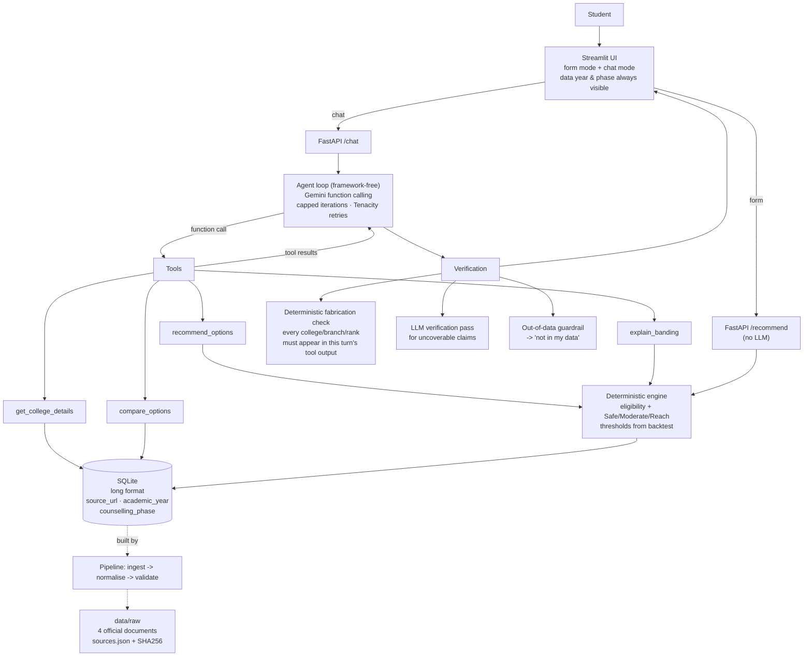

# Counselling Copilot — Design

**Status:** Phase 0 (design + data-source research). No application code written yet.
**Exam:** AP EAPCET (renamed from AP EAMCET in 2022), MPC stream (engineering).
**Last updated:** 2026-09-22

---

## 1. Problem

A student finishing AP EAPCET gets a rank and a deadline. What they actually need to
decide is: *given my rank, category, gender and region, which college+branch options are
realistic, and which are a gamble?*

What exists today is bad in two specific ways:

- **Official data is unusable as-is.** The authoritative "last rank" statements are 60-page
  PDFs with 30 columns, one column per category×gender. Finding your own number means
  scrolling to your college, then counting across to `BCB_GIRLS`. There are ~1,500
  college-branch rows per year.
- **Everything else invents numbers.** Coaching-centre "rank predictors" produce confident
  cutoffs with no source, no year and no phase attached.

There is also a hard constraint that most tools ignore. The official statement carries this
disclaimer:

> "The statement shall be used only for information to assess the mode of opting by
> candidates and **shall in no way reflect the rank upto which seat can be allotted in the
> present academic year**."

So the honest product is *not* a predictor. It is a **structured, sourced, explained view of
what actually happened last year**, with bands whose error rate we have measured and
publish.

## 2. Users

| User | Needs |
|---|---|
| **Student** (primary) | A shortlist they can act on, grouped by risk, filtered to the branch and region they care about. Follow-up questions in plain language. |
| **Parent** | Location, college type, and *why* an option is called Safe. (Fee is out of MVP scope — §5.5.) |
| **Me (portfolio)** | A system where every number is traceable to an official PDF and every claim is backed by an eval run. |

## 3. User stories

1. As a student, I enter rank 45,000 / BC-B / female / AU region and get options grouped
   Safe / Moderate / Reach, each showing last year's closing rank and the data year.
2. As a student, I ask "which of these have CSE in Visakhapatnam?" (or "…which are
   university colleges?") and get a filtered list built from tool results, not from the
   model's memory. *Originally a fee/budget filter — dropped, see §5.5.*
3. As a student, I ask "compare AITS Rajampet and Vignan Vizag for ECE" and get a
   side-by-side of the fields we actually hold.
4. As a student, I ask "why is this one Moderate?" and get the actual rule and numbers
   (my rank ÷ last year's closing rank, and the threshold it fell in).
5. As a parent, I ask "what are the placements like?" and get an honest **"not in my
   data"** — never an invented figure.

## 4. Architecture

**Why no RAG / vector DB / LangChain / LangGraph.** The corpus is ~1,500 structured rows
per year with a fixed schema. Every question a user asks maps to a `WHERE` clause and an
arithmetic comparison. Embedding-based retrieval would make exact numeric filtering
*worse* (approximate matching on numbers) while adding an index, an embedding model and a
failure mode. The agent loop is ~100 lines; a graph framework would add a dependency
without removing any of them. If a genuine need appears — e.g. free-text counselling rule
documents that must be searched — that is the moment to revisit, with a concrete case.

## 5. Data sources

All four documents were located and downloaded on **2026-09-22**, and are committed under
`data/raw/` with SHA-256 hashes in `data/raw/sources.json`.

| Year | File | Format | Host | Status |
|---|---|---|---|---|
| 2022 | `APEAMCET2022LASTRANKDETAILS.pdf` | PDF, 60 pp | apsche.ap.gov.in | ✅ downloaded |
| 2023 | `APEAPCET2023LASTRANKDETAILS.pdf` | PDF, 57 pp | apsche.ap.gov.in | ✅ downloaded |
| 2024 | `APEAMCET2024LASTRANKDETAILSNONSW.XLS` | **XLS (native)** | apsche.ap.gov.in | ✅ downloaded |
| 2025 | `EAPCET2025LASTRANKDETAILS.pdf` | PDF, 60 pp | cap.apcfss.in | ✅ downloaded |

Exact URLs:

- https://apsche.ap.gov.in/Pdf/APEAMCET2022LASTRANKDETAILS.pdf
- https://apsche.ap.gov.in/Pdf/APEAPCET2023LASTRANKDETAILS.pdf
- https://apsche.ap.gov.in/Pdf/APEAMCET2024LASTRANKDETAILSNONSW.XLS
- https://cap.apcfss.in/TET-PDF/EAPCET-DOCS/EAPCET2025LASTRANKDETAILS.pdf

No captcha or login was required. Everything downloaded with plain `curl`.

### 5.1 The portal moved — and the old one is dead

AP counselling used to run on `eapcet-sche.aptonline.in`. That host still resolves in DNS
but **refuses all connections** (tested from two networks). Counselling has moved to
**`cap.apcfss.in`** (Common Admissions Portal, run by APCFSS). The 2025 file was found by
reading the JS bundle of that single-page app; it is not linked from any crawlable HTML page.

This matters beyond convenience: **source URLs for this data rot fast.** That is why the raw
files are committed to the repo with hashes rather than fetched at build time.

### 5.2 What each statement contains

Every year has the same shape: **one row per (institution × branch)**, with one column per
category×gender.

Common columns: `SNO`, institution code, institution name, `type`, `INST_REG`, `DIST`,
`branch_code`, then the category×gender rank columns.

Categories present: **OC, SC, ST, BC-A, BC-B, BC-C, BC-D, BC-E, OC-EWS** — each split
`_BOYS` / `_GIRLS`.

College types: `PVT` (private, 232 institutions in 2024), `UNIV` (16), `SF` (self-financed, 13),
`PU` (private university, 10), `SS` (2). Local areas: **AU** and **SVU** only (OU is
Telangana). `INST_REG = 'SW'` means *State wide*, documented in the file itself.

### 5.3 Schema drift across years — three variants

This is the real engineering work in Phase 1.

| | 2022 | 2023 | 2024 | 2025 |
|---|---|---|---|---|
| Columns | 31 | 31 | 31 | **30** |
| Institution code field | `inst_code` | `INSTCODE` | `INSTCODE` | `inst_code` |
| Institution name field | `inst_name` | `NAME OF THE INSTITUTION` | `NAME OF THE INSTITUTION` | `inst_name` |
| Affiliating univ. | `AFFLIA.UNIV` | `AFFL.` | `AFFL.` | **absent** |
| `PLACE` / `COED` / `ESTD` | ✅ | ✅ | ✅ | **absent** |
| Region field | `Local_Area` (mostly blank) | `A_REG` | `A_REG` | `Local_area` (populated) |
| SC columns | `SC_BOYS/GIRLS` | same | same | **`SCI` / `SCII` / `SCIII` × B/G** |
| Category×gender cols | 18 | 18 | 18 | **22** |
| `COLLFEE` | ✅ | ✅ | ✅ | **❌ absent** |

**Two breaking changes in 2025:**

1. **SC sub-classification.** SC was split into SC-I / SC-II / SC-III (per the AP SC
   sub-classification G.O.). An SC student's 2024 row has no 1:1 successor in 2025.
2. **The fee column was dropped.** See open question Q1.

### 5.4 Coverage and overlap (2024 vs 2025)

| | 2024 | 2025 | Common |
|---|---|---|---|
| Institutions | 275 | 274 | **244** |
| Branch codes | 69 | 73 | **67** |
| College-branch pairs | 1,479 | 1,509 | **1,314** |

1,314 matched pairs × ~9 categories × 2 genders is a solid backtest base.

### 5.5 Fee data — investigated again in Phase 1

**What the official rule says.** The AP Higher Education Regulatory and Monitoring
Commission (APHERMC, the body that replaced AFRC) publishes its fee guidelines at
`aphermc.ap.gov.in`. The document
[`APHERMC_GUIDELINES_2023-26_30.06.2022.pdf`](https://aphermc.ap.gov.in/Doc2023-26/APHERMC_GUIDELINES_2023-26_30.06.2022.pdf)
states, in its own title, that it governs

> "the Fee Structure by the Commission for the **block period 2023-24 to 2025-26**".

So yes — the official fee order is a multi-year order and it **does cover 2025-26**.

**What the data shows.** That does not mean a college's fee is constant across the
block. Comparing the fee column of the 2023 and 2024 statements, for the 250 colleges
that appear in both:

| | |
|---|---|
| Fee identical in 2023 and 2024 | **138 colleges (55.2%)** |
| Fee changed inside the same block period | **112 colleges (44.8%)** |

Some changes are large: `APUCPU` 50,000 -> 99,500; `ANIL` 59,950 -> 84,100;
`ACPS` 62,400 -> 38,000. This is consistent with APHERMC's own publication list, which
carries dozens of per-institution fee-fixation orders *inside* the block
(`B.Tech_G O Ms No 18_2024-25.pdf`, `B.Tech_G O Ms No 23_2024-25.pdf`, and so on).

**Conclusion.** The block period covers 2025, but "the block covers 2025" does not
license "the 2024 fee is the 2025 fee" — that inference is wrong for roughly 45% of
colleges, sometimes by 100%. Carrying a 2024 fee into a 2025 recommendation would put a
plausible, official-looking, wrong number in front of a family making a money decision.

**Fee therefore stays out of the MVP product surface** (see Q1). `fee_inr` is still
ingested for 2022-2024 because it is in the source; nothing reads it. A per-college fee
list for 2025-26 would resolve this properly; none was found on `aphermc.ap.gov.in`
(the block-period spreadsheet there is a blank submission template, not a fee schedule)
and `afrc.ap.gov.in` remains unreachable.

### 5.6 The official disclaimer (stored verbatim in `sources.json`)

Recorded because it constrains the product, not just the docs:

- Special reservation categories (PWD, NCC, Sports, CAP, Scouts & Guides, Minority
  colleges) are **not reflected**.
- Ranks are **at the end of the web counselling process** and exclude dropouts and spot
  admissions. *This is how we set `counselling_phase`, since no document states a phase
  explicitly.*
- The statement **must not be read as the rank up to which a seat can be allotted**.
- **"Girls are also eligible for Boys seats."** → a concrete eligibility rule (§7.1).

### 5.7 Local area (AU / SVU / OU) across the four years

Checked because the column moves and renames between years.

**OU never appears, and never should.** The official reservation order
[`2026_LocalNonlocalReservation.pdf`](https://cets.apsche.ap.gov.in/apsche/PDF/2026_LocalNonlocalReservation.pdf)
(G.O.MS.No. 20, dated 12-05-2025) defines exactly two local areas for Andhra Pradesh:
"(a) Andhra University Area" and "(b) Sri Venkateswara University Area". The word
"Osmania" does not occur in the document — OU is Telangana, and after the 2014
bifurcation it is not an AP local area. The pipeline asserts this: a validation check
fails if any value other than AU or SVU ever appears.

| Year | Column name | Populated? | Handling |
|---|---|---|---|
| 2022 | `Local_Area` | **Only for state-wide (SW) colleges** | Blank rows fall back to the college's own region, flagged `local_area_derived = true` (93.7% of 2022 rows) |
| 2023 | `A_REG` | All rows | Used directly |
| 2024 | `A_REG` | All rows | Used directly |
| 2025 | `Local_area` | All rows | Used directly |

So the column **did change** — twice in name (`Local_Area` -> `A_REG` -> `Local_area`)
and once in meaning (2022 populates it only for state-wide colleges). Two separate
fields are involved and must not be confused:

- `inst_region` — where the *college* sits: AU, SVU, or **SW** (state-wide). The 2024
  statement documents `SW` in its own footnote: *"Inst_reg 'SW' means State wide"*.
- `local_area` — which *applicant* region the row's ranks apply to. A state-wide college
  gets two rows, one for AU applicants and one for SVU applicants.

For a state-wide college with no local area given, the value stays **null**; we never
guess a region.

### 5.8 Branch names — no official list exists

Searched for an official branch-code-to-name table in:

- all four last-rank statements (no legend page in any of them),
- the 2026 MPC third-and-final-phase detailed notification (`cap.apcfss.in`),
- the 2026 engineering instruction booklet (`cets.apsche.ap.gov.in`),
- the official APSCHE "Courses" page — which lists only broad streams
  (Engineering, Bio-Technology, B.Pharmacy...), never codes.

The counselling portal's own front-end does carry a `branch_name` field, but it is a
JavaScript single-page app with no public API: every `/api/...` path returns the app's
HTML shell (`Content-Type: text/html`), not data.

**Conclusion: no official source. Every branch name in this project is therefore marked
`name_status = unofficial` in `data/mappings/branch_map.csv`**, with a `confidence`
column. Where confidence is low the name is left **blank** rather than invented, and the
UI shows the raw code. 77 codes total: 20 high confidence, 16 medium, 41 left blank. The
36 named codes cover **95.4% of all rows**, because the unnamed ones are rare branches.

## 6. Data model

One long-format table, `cutoffs` — one row per
`(year, phase, college, branch, category, gender, local_area)`:

| Column | Type | Notes |
|---|---|---|
| `year` | int | 2022–2025 |
| `counselling_phase` | text | `end_of_web_counselling` |
| `college_code` | text | normalised |
| `college_name` | text | normalised |
| `district` | text | `DIST` |
| `region` | text | AU / SVU / SW |
| `college_type` | text | PVT / UNIV / SF / PU / SS |
| `branch_code` | text | normalised |
| `branch_name` | text | from mapping file |
| `category` | text | OC, SC, SC-I/II/III, ST, BC-A…BC-E, OC-EWS |
| `gender` | text | BOYS / GIRLS |
| `local_area` | text | applicant region |
| `closing_rank` | int, **nullable** | missing stays missing |
| `fee_inr` | int, **nullable** | ingested for 2022–2024, null for 2025. **Not surfaced** — see §5.5 |
| `source_url` | text | FK into `sources.json` |

Nullable is load-bearing: a blank cell means *no candidate of that category was admitted to
that branch*, which is **not** the same as "rank 999,999". The old project filled blanks with
999999; that is exactly the bug we are not repeating.

Supporting, human-auditable mapping files (checked into git, reviewed by hand):
`branch_map.csv` (branch_code → canonical code + full name), `college_map.csv` (code
variants → canonical), `category_map.csv` (including the 2025 SC split).

## 7. Phase 2 — Deterministic engine + backtest *(plan, for approval)*

### 7.1 Eligibility rules (deterministic)

- Effective closing rank for a **boy** = `closing_rank[category][BOYS]`.
- Effective closing rank for a **girl** = `max(closing_rank[category][GIRLS],
  closing_rank[category][BOYS])` — because the official disclaimer states girls are also
  eligible for boys seats, so the more lenient of the two applies. (Larger rank number =
  more lenient.)
- If the relevant cell is null → option is **excluded**, with reason `no_data`. Never imputed.
- Local-area filter: applicant's `local_area` must match, or the institution is `SW`.

### 7.2 Banding

`r = student_rank / previous_year_closing_rank`

| Band | Condition | Tuned value | Meaning |
|---|---|---|---|
| **Safe** | `r ≤ t1` | **r ≤ 0.76** | comfortably inside last year's closing rank |
| **Moderate** | `t1 < r ≤ t2` | **0.76 < r ≤ 1.15** | near the line |
| **Reach** | `t2 < r ≤ t3` | **1.15 < r ≤ 1.51** | outside last year's line but plausible |
| *(excluded)* | `r > t3` | **r > 1.51** | not shown |

`t1`, `t2`, `t3` are **not guessed**. Each line is drawn where the chance of getting in
*for a student sitting at that line* falls to a set level on the tuning fold: 90% for
Safe, 50% for Moderate, 20% for Reach. Measured **at** the line, not averaged below it —
averaging lets a band's comfortable middle hide a weak edge, and an early version that
averaged produced a Moderate band 0.01 wide. Stored in `data/mappings/thresholds.json`.

**Within a band, options are ordered most-competitive-first** (lowest closing rank), so
the best college a rank can reach appears at the top. Last year's closing rank is used as
a stand-in for how sought-after a college is; it is a revealed preference from the data,
never presented as a quality ranking.

### 7.3 Backtest design — **two folds (decided 2026-09-22)**

Band using year *N−1*, check against year *N* actuals. Two folds:

- **Fold A — 2023 → 2024.** Both years share the 18-column schema, so **all categories**
  including SC are comparable. Used to **tune** `t1,t2,t3`.
- **Fold B — 2024 → 2025.** Held out for **validation**. SC is excluded here (the
  sub-classification break makes it non-comparable) and that exclusion is reported, not hidden.

**Results (produced by `python -m copilot.engine.backtest`, full report in
[BACKTEST.md](BACKTEST.md)):**

| Band | Fold A — tuning (2023→2024) | Fold B — hold-out (2024→2025) |
|---|---|---|
| Safe | 97.1% | **97.8%** |
| Moderate | 72.8% | **67.7%** |
| Reach | 29.7% | **33.9%** |

Fold B is the number that counts; Fold A is circular by construction. The hold-out held
up — Safe stayed at ~98% on a year the limits had never seen — and the bands stay clearly
separated, which is what makes the labels mean anything. Fold B covers 17,959 matched
options and 10.5M simulated student-option pairs, SC excluded.

**This is the honest, measurable core of the project.** Tuning on Fold A and validating on
Fold B, with SC exclusion stated, is what makes it defensible in an interview. The report
also discloses that the hold-out was evaluated twice, because a flaw in the first tuning
method had to be fixed.

### 7.4 Required disclosure for SC students (non-negotiable)

Because 2025 replaced SC with SC-I / SC-II / SC-III, the 2024 -> 2025 validation fold
cannot test SC at all. The Safe / Moderate / Reach thresholds are therefore **tuned on
SC data from 2023 -> 2024, but never validated on held-out SC data**.

**The app must tell SC students this, every time.** Whenever the selected category is
SC, SC-I, SC-II or SC-III, the results screen and the chat answer must both carry a
visible line to the effect of:

> "Heads up: the Safe / Moderate / Reach grouping could not be tested for SC categories.
> In 2025 the state split SC into SC-I, SC-II and SC-III, so last year's SC results
> cannot be compared like-for-like. Treat these groupings as less reliable than the
> ones shown for other categories."

This is a product requirement, not a nice-to-have: an untested band presented with the
same confidence as a tested one is exactly the kind of quiet overclaim this project
exists to avoid. It gets its own eval case in Phase 4.

## 8. Phase 3 — Agent layer **(built)**

- **Framework-free tool-calling loop** over Gemini function calling. Max **6** iterations,
  then a forced final answer. Tenacity: exponential backoff on 429/5xx.
- **Tools:** `recommend_options`, `get_college_details`, `compare_options`, `explain_banding`.
- **Pydantic v2 response schema.** Every recommendation carries `college_code`,
  `branch_code` and `data_year`, copied from tool results.
- **Deterministic fabrication check.** Every college code, branch code, rank and fee in the
  final answer must appear in *that turn's* tool outputs. On failure: regenerate once, then
  strip the offending value.
- **LLM verification pass** for claims the deterministic check cannot cover (e.g. a
  mis-stated comparison in prose).
- **Guardrails.** Out-of-data questions (placements, "is this college good?", hostel quality)
  → honest "not in my data".

## 9. Phase 4 — App, eval, deploy, docs *(4a and eval built; app and deploy still to come)*

- **FastAPI:** `/recommend` (no LLM, deterministic) and `/chat` (agent).
- **Streamlit:** form mode + chat mode; data year and phase always visible; the official
  disclaimer shown, not buried.
- **Agent eval:** 25–30 hand-written cases in `evals/cases.jsonl` with expected tool calls
  and constraints. Measured: tool-routing accuracy, fabrication-check pass rate,
  schema-valid rate, latency and cost per query. All results `[TBD after eval]` until run.
- **Docker**, free-tier deploy, README with real numbers only.

### 9.1 The free-tier limit is a product constraint, not just an ops detail

Measured, not guessed: the API returned

    quotaId    GenerateRequestsPerDayPerProjectPerModel-FreeTier
    quotaValue 20

So the free tier allows **20 requests per day, per model, per project**. One chat
question costs about two requests (one to pick a tool, one to answer), so a single
model supports roughly **ten chat questions a day**. The quota is per model, so
changing `GEMINI_MODEL` gets a separate allowance.

**This shapes the app, and the app must be built around it:**

- **The form mode must never depend on the AI.** `/recommend` and the form UI call the
  deterministic engine directly. They keep working when the chat quota is gone, when the
  API is down, and when there is no key at all. The form is the product; the chat is a
  convenience on top of it.
- **When the chat quota runs out, say so plainly and point at the form.** Not a stack
  trace, not a silent failure, not a made-up answer. Something like: *"I have hit today's
  chat limit. The search form below still works and uses the same data."*
- A `429` must be told apart from a `401`. Out of quota and bad credentials need
  different messages, because they need different actions from the user.

### 9.2 API key format

Keys issued by AI Studio now begin with `AQ.`. The older `AIza` format is being phased
out. An `AQ.` key is the normal, current format - not a temporary token. Recorded here
because an early assumption that only `AIza` was valid led to a wrong diagnosis.

## 10. Scope

**MVP (2–3 days)**
AP only · MPC stream · 2025 as the recommending year, 2024/2023 for backtest · filters on
branch / region / district / college type · the four tools · form + chat · fabrication
check · backtest + agent eval · Docker + one deployment.

**Later (explicitly not now)**
**Fee and the budget filter** (no official 2025 source — §5.5) · TG EAPCET · BiPC stream
(agriculture/pharmacy — the 2025 BiPC statement exists at
`cap.apcfss.in/TET-PDF/EAPCET-BIPC-DOCS/AP_EAPCET_BIPC_2025_LAST_RANK_DETAILS.pdf`) ·
**NAAC/NBA accreditation join** (needs a naac.gov.in scrape plus fuzzy college-name
matching across sources — roughly half a day, and silent wrong joins are the likely
failure) · seat-matrix data · special reservation categories (PWD, NCC, Sports, CAP) which
the source explicitly excludes · placements (no official source exists).

## 11. Risks

| # | Risk | Mitigation |
|---|---|---|
| R1 | **The source forbids predictive use** (disclaimer §5.6). | Position as "what happened last year + measured bands", never a guarantee. Show the disclaimer in the UI. Publish backtest error rates. |
| R2 | **SC sub-classification break (2025).** | Tune on Fold A (2023→2024) where SC is comparable; exclude SC from Fold B and say so. UI collects SC-I/II/III for 2025. |
| R3 | **No 2025 fee data.** | **Resolved:** fee and the budget filter are out of the MVP (§5.5). No year-mixing, no "not available" clutter. Revisit only if an official 2025 fee notification is found. |
| R4 | **Gemini free-tier limits and availability.** Confirmed in practice: `gemini-3.8-flash` returned `503 UNAVAILABLE - experiencing high demand` on the free tier and could not be used at all. | `GEMINI_MODEL` is an env var, so the switch to `gemini-3.5-flash` was a one-line config change with no code touched. Tenacity retries 429/5xx with backoff. The eval pauses between questions. Flash-Lite remains available if daily limits bite. |
| R8 | **TLS-inspecting networks break the SDK.** College wifi, office proxies and some antivirus re-sign every connection with their own certificate authority. Python ships its own certificate bundle and never consults the machine's, so the SDK fails with `CERTIFICATE_VERIFY_FAILED` where the browser works fine. Hit on the very first live call. | The client also trusts the OS certificate store via `truststore`. Certificates are still verified — we just look where the rest of the machine looks. |
| R9 | **The checker's false positives are the real risk, not its misses.** Three surfaced only when talking to the live model: official region names, numbers printed inside a tool's sentence, and words inside a genuine college name. Each one silently deleted something true. | Every one is now pinned by a test. The lesson recorded here: a checker that is too aggressive destroys trust just as fast as one that is too loose, and only real traffic finds those cases. |
| R5 | **Source URLs rot** — `eapcet-sche.aptonline.in` is already dead. | Raw files committed with SHA-256; `sources.json` records the original URL and retrieval date. |
| R6 | **PDF extraction errors.** | `pdfplumber` gave a clean, constant 31/30-column table on every page of all three PDFs. Phase 1 adds row-count and null-rate checks plus a 10-row manual spot-check against the source PDF. |
| R7 | **Scope creep** into a general "college chatbot". | Tools are a closed set of four. Anything outside the table returns "not in my data". |

## 12. Decisions and open questions

### Resolved (2026-09-22)

**Q1 — 2025 fee. → CONFIRMED CLOSED (2026-09-22): fee stays out, permanently.**
Re-investigated in Phase 1. The official APHERMC order *is* a multi-year order covering
the block period **2023-24 to 2025-26**, so it formally covers 2025. But the fee actually
changed for **44.8% of colleges (112 of 250) between 2023 and 2024 inside that same
block**, sometimes by 100%. "The block covers 2025" therefore does not justify "the 2024
fee is the 2025 fee" — that inference is wrong for nearly half of all colleges. Sravya
confirmed: keep fees out. Full working in §5.5.

**Q2 — Backtest pairing. → Two folds.** Tune `t1,t2,t3` on Fold A (2023→2024, all
categories comparable); validate on held-out Fold B (2024→2025, SC excluded and reported).
See §7.3.

**Q4 — NAAC/NBA. → Out of MVP scope.** Needs a naac.gov.in scrape plus fuzzy college-name
matching; roughly half a day and prone to silent wrong joins. Listed under §10 Later.

### Resolved in Phase 1 (2026-09-22)

**Branch names -> unofficial.** No official code-to-name list exists in any counselling
document (§5.8). All names are marked `unofficial`; low-confidence codes are left blank
rather than guessed.

**Local area -> AU and SVU only, and the column moved.** `Local_Area` -> `A_REG` ->
`Local_area` across the four years, and 2022 populates it only for state-wide colleges
(§5.7). OU is Telangana and a validation check fails if it ever appears.

**SC disclosure -> required in the UI and in chat answers** whenever the category is SC
or an SC sub-category (§7.4).

**Q5 (branch-name source) -> closed** by §5.8.

### Still open

*(Nothing blocking. Q6 — the fee question — was closed by Sravya on 2026-09-22: fees
stay out, because they changed for 45% of colleges inside the fee block. See Q1.)*
